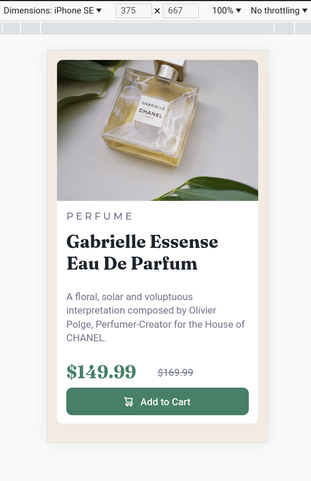

# Frontend Mentor - Product preview card component solution

This is a solution to the [Product preview card component challenge on Frontend Mentor](https://www.frontendmentor.io/challenges/product-preview-card-component-GO7UmttRfa). Frontend Mentor challenges help you improve your coding skills by building realistic projects.

## Table of contents

-   [Overview](#overview)
    -   [The challenge](#the-challenge)
    -   [Screenshot](#screenshot)
    -   [Links](#links)
-   [My process](#my-process)
    -   [Built with](#built-with)
    -   [What I learned](#what-i-learned)
-   [Author](#author)

**Note: Delete this note and update the table of contents based on what sections you keep.**

## Overview

### The challenge

Users should be able to:

-   View the optimal layout depending on their device's screen size
-   See hover and focus states for interactive elements

### Screenshot




### Links

-   Solution URL: [Add solution URL here](https://your-solution-url.com)
-   Live Site URL: [Add live site URL here](https://your-live-site-url.com)

## My process

### Built with

-   [React](https://reactjs.org/)
-   [Vite](https://https://vitejs.dev/)
-   Mobile-first workflow
-   CSS custom properties
-   CSS Flexbox
-   CSS Grid
-   CSS Media Queries

**Note: These are just examples. Delete this note and replace the list above with your own choices**

### What I learned

-   CSS Grid and Flexbox are so good at moving stuff around on a page.

-   Working on this project was fun and challenging, for someone who had not really focused too much, on the design side of web development. It served as a well needed refresher to the vastness of css and helped apply my knowledge, within the bounds of the challenge.

-   I decided to utilize react's useEffect and useState hooks, to add event listeners on the global window object and store current image src as state. That way, I could swap the src in the app component, based on the current window size and update said src state accordingly, whenever someone resizes the window. I went down this path to reinforce some of my react skills, though I am aware that there are a few other ways of handling this process of
    image swapping.

-   Snippet below for my method (within the app component):

```js - react
// Outside App
const initSrcByScreenState = () => {
    return window.innerHeight >= 576 ? productImgDesktop : productImgMobile;
};

// In App
const [currentImgSrc, setCurrentImgSrc] = useState(() =>
    initSrcByScreenState()
);

useEffect(() => {
    const handleResize = (e) => {
        if (e.currentTarget.innerWidth < 576) {
            setCurrentImgSrc(productImgMobile);
            console.log("less than 576");
        }

        if (e.currentTarget.innerWidth >= 576) {
            setCurrentImgSrc(productImgDesktop);
            console.log("greater than or equal to 576");
        }
    };

    window.addEventListener("resize", handleResize);

    return () => window.removeEventListener("resize", handleResize);
}, []);
```

-   I am starting to see exactly how much easier developing with a mobile-first approach, makes life. Aside from needing a single media query to adjust some properties on certain elements, when resizing to desktop, not much time and effort was needed on this end. Though the project is small in scale, I found approaching it this way, was highly beneficial to me.

## Author

-   Github - [Gabriel Garcia](https://github.com/GabeGar)
-   Frontend Mentor - [@GabeGar](https://www.frontendmentor.io/profile/GabeGar)
